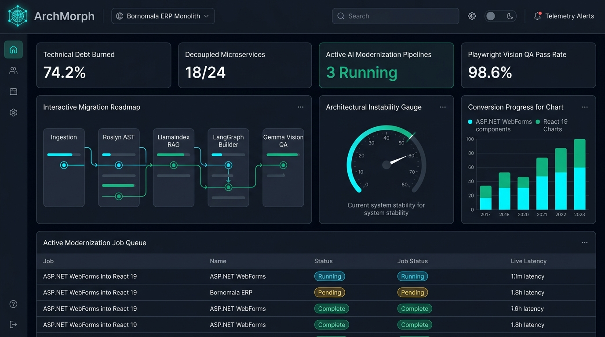

# Screen 1: Web Executive Command Center

## Visual Render

## Purpose & Overview
The central high-level management dashboard for the ArchMorph Software Modernization Platform. It aggregates modernization metrics across the entire enterprise portfolio and displays live pipeline execution health.

## Core Features Implemented:
1. **Brand Identity Header**:
   - Universal transparent ArchMorph brand badge with glowing neural cube icon.
   - Global project switcher: Active target 'Bornomala ERP Monolith'.
   - Global search, light/dark theme switch, and live telemetry alert indicator.
2. **Executive KPI Telemetry Row**:
   - Technical Debt Burned: 74.2%
   - Decoupled Microservices: 18/24
   - Active AI Modernization Pipelines: 3 Running
   - Playwright Vision QA Pass Rate: 98.6%
3. **Interactive Migration Roadmap Card**:
   - Visual 5-stage progress pipeline mapping the 42 engines: Ingestion -> Roslyn AST -> LlamaIndex RAG -> LangGraph Builder -> Gemma Vision QA.
4. **Architectural Instability Gauge**:
   - Computes  = \frac{C_e}{C_a + C_e}$ across monolith modules.
5. **Modernization Conversion Progress Chart**:
   - Stacked bar analytics tracking ASP.NET WebForms legacy controls converted to React 19 JSX components.
6. **Active Modernization Job Queue**:
   - Interactive DataTable displaying active batch transformations, status badges (Running, Pending, Complete), and live latency metrics.
