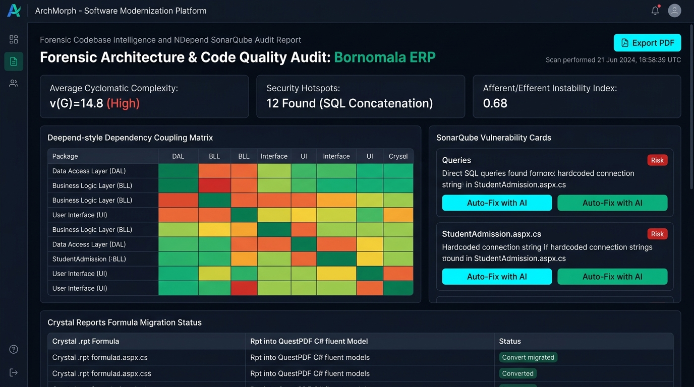

# Screen 2: Web Forensic NDepend & SonarQube Report

## Visual Render

## Engines Implemented:
* project_overview_builder.js & project_overview_builder_v2.js
* solution_auditor.js
* csharp_roslyn_tracer.js
* crystal_rpt_extractor.js
* page_behavioral_mapper.js

## Core Features & Data Visualizations:
1. **Executive Forensic Audit Header**:
   - Project target: Bornomala ERP Monolith.
   - Global Export PDF report button & scan timestamp.
2. **Top Architectural Metrics**:
   - **Average Cyclomatic Complexity**: (G)=14.8$ (High) across legacy CodeBehind scripts.
   - **Security Hotspots**: 12 critical issues flagged (direct string concatenation in SQL commands).
   - **Afferent/Efferent Instability Metric**:  = \frac{C_e}{C_a + C_e} = 0.68$, quantifying fragile architectural layers.
3. **NDepend-Style Dependency Coupling Heat Matrix**:
   - Cross-package interaction matrix (Data Access Layer, Business Logic Layer, UI controls).
   - Color-coded cells (Green = low coupling, Orange = moderate, Red = dangerous circular coupling).
4. **SonarQube Vulnerability Cards**:
   - Detailed security vulnerability cards pinpointing vulnerable files (e.g., StudentAdmission.aspx.cs).
   - Integrated 'Auto-Fix with AI' action buttons directly invoking the modernization transformation engine.
5. **Crystal Reports Migration Status Table**:
   - Automated conversion tracking of legacy Crystal Reports .rpt formulas and tables into modern QuestPDF C# fluent models.
