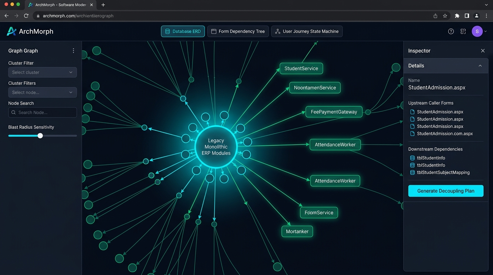

# Screen 3: Web Mermaid Topology & User Journey Graph Studio

## Visual Render

## Engines Implemented:
* orm_dependency_graph.js
* dependency_graph_tracer.js
* user_journey_graph.js
* user_flow_analyzer.js
* entity_clusterer.js

## Core Features & Interactive Capabilities:
1. **Multi-Model Diagram Viewport Switcher**:
   - Tab 1: **Database ERD** (physical SQL tables, primary/foreign keys).
   - Tab 2: **Form Dependency Tree** (cross-layer caller hierarchies).
   - Tab 3: **User Journey State Machine** (multi-step user paths & postbacks).
2. **Interactive Cybernetic Topology Canvas**:
   - Central glowing core representing legacy monolithic ERP modules.
   - Directed vector arrows illustrating decoupling paths into independent microservices (StudentService, FeePaymentGateway, AttendanceWorker).
   - Glowing color cues: Cyan nodes (Legacy Monolith), Emerald nodes (Decoupled Microservices).
3. **Graph Controls & Sensitivity Toolbar (Left Sidebar)**:
   - Cluster filtering by domain entity.
   - Node live search input.
   - **Blast Radius Sensitivity Slider**: Dynamically adjusts dependency depth to highlight high-risk dependencies.
4. **Node Inspector Drawer (Right Side)**:
   - Deep inspection of selected node (StudentAdmission.aspx).
   - List of Upstream Caller Forms.
   - List of Downstream Schema Dependencies (	blStudentInfo, 	blStudentSubjectMapping).
   - 1-Click Action: **'Generate Decoupling Plan'** triggering the automated microservice extractor.
