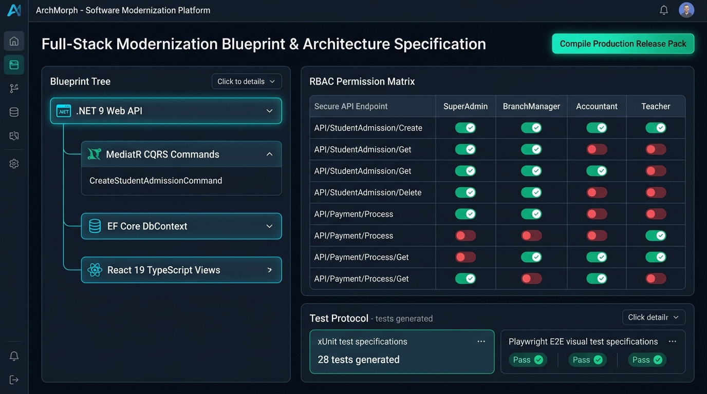

# Screen 4: Web Modernization Blueprint & RBAC Matrix Studio

## Visual Render

## Engines Implemented:
* lueprint_generator.js
* modernization_blueprint_compiler.js
* db_modernizer.js
* 
bac_navigation_planner.js
* 	est_protocol_generator.js
* 	emplate_sanitizer.js

## Core Features & System Architecture:
1. **Target Architecture Blueprint Hierarchy**:
   - Modern target stack: **.NET 9 Web API** root container.
   - Decoupled application layer: **MediatR CQRS Commands & Queries** (CreateStudentAdmissionCommand).
   - Data persistence layer: **EF Core DbContext** & automated SQL DDL index generator.
   - Client presentation layer: **React 19 TypeScript Views** (clean functional components with Tailwind styling).
2. **Interactive Enterprise RBAC Permission Matrix**:
   - Endpoints mapped to enterprise roles: SuperAdmin, BranchManager, Accountant, Teacher.
   - Color-coded security toggles (Green = authorized, Red = restricted/denied).
   - Prevents unauthorized endpoint exposure during migration.
3. **Automated Test Protocol Suite**:
   - **xUnit Test Specifications**: 28 automated integration test suites generated from legacy business rules.
   - **Playwright E2E Visual Tests**: Multi-viewport visual stability tests with automated pass/fail indicators.
4. **Compile Production Release Pack Action**:
   - Compiles sanitized, de-branded, production-grade microservice source code packages ready for deployment.
