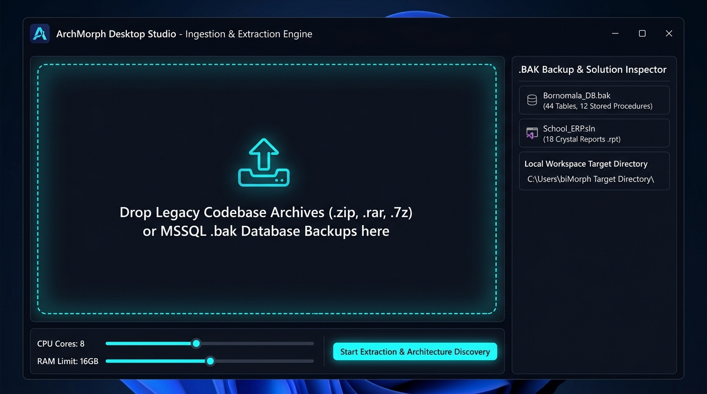

# Screen 5: Desktop Multi-Archive & MSSQL .BAK Ingestion Studio

## Visual Render

## Engines Implemented:
* rchive_extractor.js
* sql_bak_extractor.js
* project_curator.js
* zip_packager.js

## Core Features & Desktop Architecture:
1. **Frameless Native Window Architecture**:
   - Designed for Windows 11 (Tauri / Electron wrapper) with dark mica backdrop.
   - Titlebar with native minimize, maximize, and close controls.
2. **Multi-Archive Drag-and-Drop Ingestion Zone**:
   - Universal ingestion support for .zip, .rar, .7z, and direct raw source directories.
   - Dedicated direct ingestion of MSSQL .bak binary database backup files.
3. **Smart .BAK & Solution Inspection Panel**:
   - Automated file header inspection without requiring a live SQL server instance.
   - Displays detected database statistics: physical tables (44), stored procedures (12), and Crystal Reports files (18).
4. **Local Hardware Allocation Controls**:
   - Fine-grained controls for multi-core extraction: CPU Cores slider (8 cores) and RAM allocation limit (16GB RAM).
   - Prevents system freezes on local developer machines during heavy AST parsing.
5. **Start Extraction & Architecture Discovery Action**:
   - Unpacks archives, sorts source code into standardized directories (project/, database/, 
eports/, config/), and compiles initial metadata into platform_db.json.
