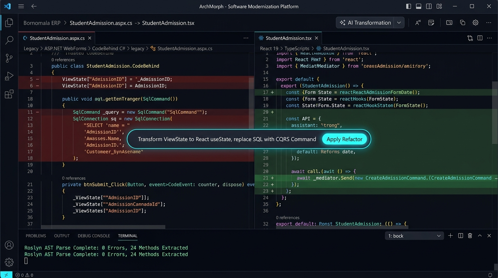

# Screen 6: Desktop Code Modernizer & Diff Studio

## Visual Render

## Engines Implemented:
* aspx_razor_parser.js
* csharp_roslyn_tracer.js
* page_behavioral_mapper.js
* dual_visual_comparator.js
* local_codebase_builder.js

## Core Features & Developer Experience:
1. **Interactive Dual-Pane Diff Workspace**:
   - Left Pane (Legacy Monolith): StudentAdmission.aspx.cs (ASP.NET WebForms CodeBehind in C#). Red deletion highlights clearly mark obsolete patterns (ViewState, direct SqlCommand SQL concatenation, tight UI coupling).
   - Right Pane (Modern Target): StudentAdmission.tsx (React 19 + TypeScript + Tailwind). Green addition highlights show modern functional hooks, clean form states, and decoupled CQRS dispatchers.
2. **AI Modernization Rulebook Pill**:
   - Floating context prompt: Transform ViewState to React useState, replace SQL with CQRS Command.
   - Glowing 'Apply Refactor' action button triggering real-time local AST rewrites.
3. **Integrated Development Terminal**:
   - Real-time Roslyn compilation & AST parser logs: Roslyn AST Parse Complete: 0 Errors, 24 Methods Extracted.
   - Instant syntax validation ensuring zero semantic drift during code transformation.
