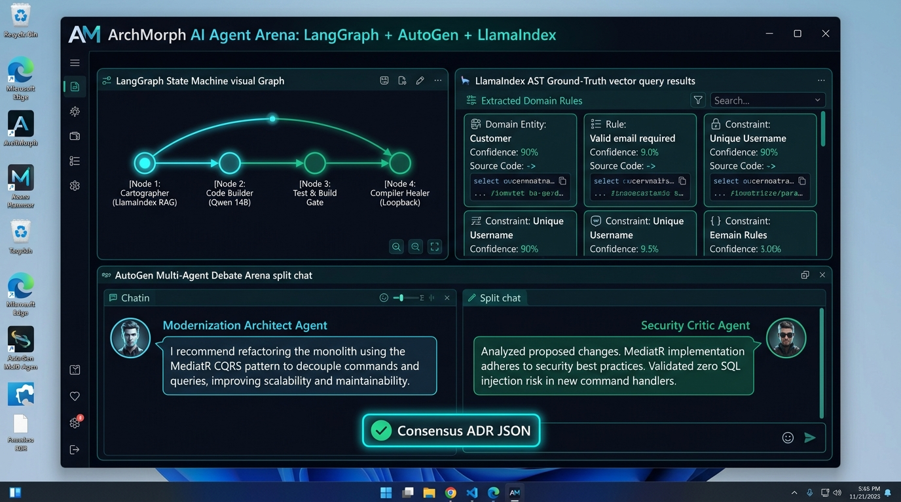

# Screen 7: Desktop Multi-Agent LangGraph & AutoGen Arena

## Visual Render

## Engines Implemented:
* LangGraph State Machine Orchestrator
* LlamaIndex AST Ground-Truth Vector RAG
* AutoGen Multi-Agent Debate Engine
* ai_router.js
* container_orchestrator.js
* qa_convergence_engine.js

## Core Features & Multi-Agent Architecture:
1. **LangGraph Deterministic State Machine Visualizer**:
   - Visual state machine graph tracking active modernization execution flow:
     - Node 1: Cartographer (Queries LlamaIndex for AST domain rules).
     - Node 2: Code Builder (Qwen 2.5 Coder 14B model generates modern .NET 9 & React 19).
     - Node 3: Test & Build Gate (Executes build and unit test suites).
     - Node 4: Compiler Healer (Loopback self-healing mechanism upon build errors, bounded to max 3 attempts).
2. **LlamaIndex AST Ground-Truth Vector Query Panel**:
   - Live query terminal extracting domain invariants directly from legacy AST chunks.
   - Displays extracted domain rules (entity constraints, required fields, business logic confidence %).
3. **AutoGen Peer Review Debate Arena**:
   - Dual-agent split dialogue resolving architecture dilemmas:
     - **Modernization Architect Agent (Qwen 14B)**: Proposes modern architectural patterns (MediatR CQRS, EF Core).
     - **Security Critic Agent**: Challenges and validates zero-defect security compliance (verifies elimination of direct SQL concatenation).
   - **Consensus ADR JSON**: Generates a signed Architecture Decision Record locking in the consensus design.
