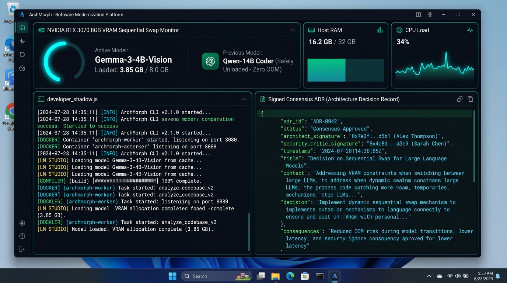

# Screen 8: Desktop 8GB VRAM Telemetry & Signed ADR Report

## Visual Render

## Engines Implemented:
* developer_shadow.js
* db.js
* server.js
* Hardware 8GB VRAM Sequential Swap Controller
* AutoGen ADR Consensus Signer

## Core Features & Telemetry Capabilities:
1. **RTX 3070 8GB VRAM Sequential Swap Monitor**:
   - Hardware telemetry preventing CUDA Out-Of-Memory (OOM) crashes on local developer laptops (Legion 5 Pro).
   - Real-time model lifecycle status:
     - Active Model: Gemma-3-4B-Vision (Allocated: 3.85 GB / 8.0 GB VRAM - 100% GPU acceleration).
     - Previous Model: Qwen-14B Coder (Safely unloaded from VRAM to host RAM prior to vision inference).
   - Host RAM meter (16.2 GB / 32 GB utilized) and live CPU load wave gauge.
2. **Live WebSocket Terminal Log Stream (developer_shadow.js)**:
   - High-throughput ANSI colored output stream capturing:
     - Docker worker container lifecycle events (archmorph-worker).
     - LM Studio CLI daemon orchestration (lms load / lms unload).
     - Real-time compiler and AST analysis progress.
3. **Signed Consensus ADR (Architecture Decision Record) Inspector**:
   - Live JSON view of the cryptographically signed ADR document.
   - Captures consensus metadata: adr_id: 'ADR-0042', status: 'Consensus Approved', signed by both the Modernization Architect and Security Critic agents.
