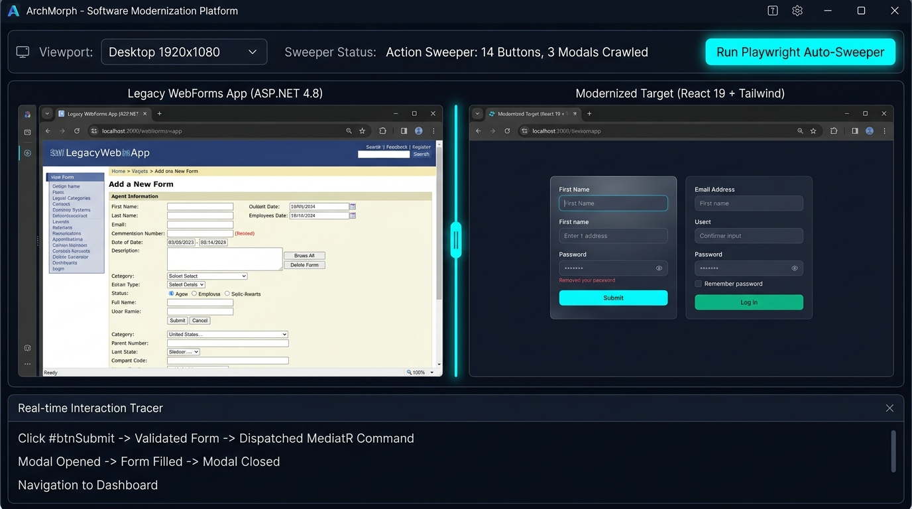

# Screen 9: Desktop Dual Visual Comparator & Playwright Sweeper

## Visual Render

## Engines Implemented:
* dual_visual_comparator.js
* action_sweeper.js
* interaction_tracer.js
* feature_extractor.js
* ground_truth_extractor.js

## Core Features & Visual QA Capabilities:
1. **Side-by-Side Dual Engine Comparison**:
   - Left Browser Viewport: Live rendered legacy web application (ASP.NET 4.8 WebForms legacy interface).
   - Right Browser Viewport: Live rendered modernized web application (React 19 + TypeScript + Tailwind CSS).
   - Interactive vertical swipe comparison slider allowing pixel-perfect alignment and UX verification.
2. **Playwright Automated Action Sweeper Toolbar**:
   - Multi-viewport resolution switcher (Desktop 1920x1080, Tablet 1280x800, Mobile 375x667).
   - Automated crawler tracking interactive surface coverage: 14 buttons and 3 modals crawled and validated.
   - 1-Click execution button: 'Run Playwright Auto-Sweeper'.
3. **Real-time Interaction Tracer (Bottom Dock)**:
   - Records live user DOM events and state changes:
     - Click #btnSubmit -> Validated Form -> Dispatched MediatR Command.
     - Modal Opened -> Form Filled -> Modal Closed.
     - Navigation to Dashboard.
   - Guarantees zero lost business functionality during modernization.
