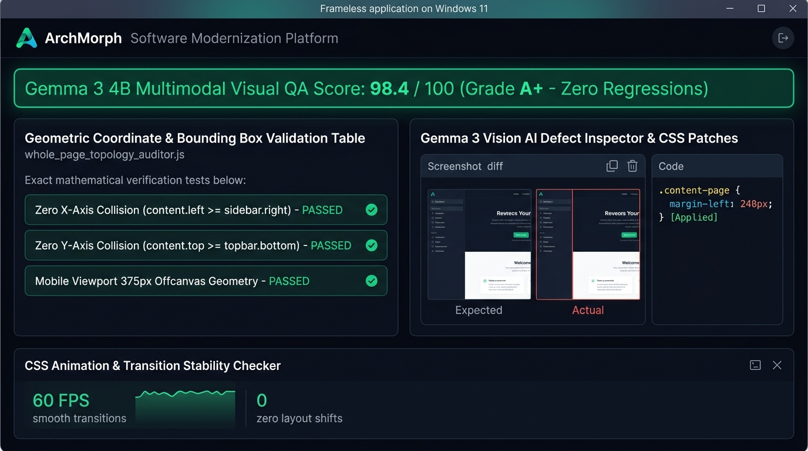

# Screen 10: Desktop Multimodal Vision QA & Geometric Topology Report

## Visual Render

## Engines Implemented:
* whole_page_topology_auditor.js
* universal_deep_comparator.js
* visual_ai_extractor.js
* animation_checker.js
* Gemma 3 4B Multimodal Vision Model

## Core Features & AI Visual Auditing:
1. **Multimodal Visual QA Scorecard**:
   - Gemma 3 4B Vision evaluation: 98.4 / 100 (Grade A+ - Zero Regressions).
   - Instant visual verification confirming zero layout degradation between legacy and modernized React 19 pages.
2. **Geometric Coordinate & Bounding Box Validation Table (whole_page_topology_auditor.js)**:
   - Mathematical layout collision checks:
     - Zero X-Axis Collision: content.left >= sidebar.right (PASSED).
     - Zero Y-Axis Collision: content.top >= topbar.bottom (PASSED).
     - Mobile Viewport 375px Offcanvas Geometry (PASSED).
3. **Vision AI Defect Inspector & Automated CSS Patches**:
   - Automated screenshot diff comparing expected design to actual browser render.
   - Self-healing code patch: '.content-page { margin-left: 240px; } [Applied]' resolving sidebar clipping defects.
4. **CSS Animation & Transition Stability Checker**:
   - 60 FPS smooth transition telemetry and zero layout shifts (Cumulative Layout Shift = 0.00).
